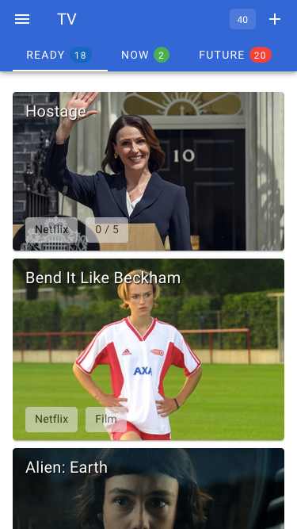
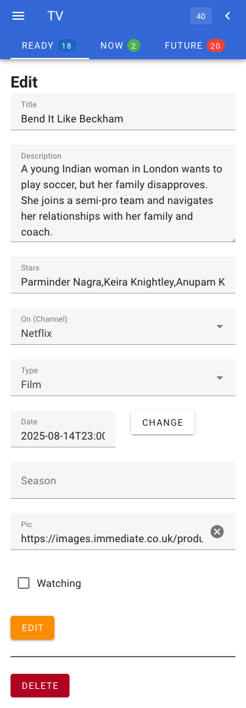

# tv

## Terraform-built infrastructure

This app requires some Cloudflare infrastructure, all of which is created using Terraform:

1. A KV namespace.
2. A Cloudflare Pages project, tied to this repo with a binding to the KV Namespace from (1).
3. A custom domain whose traffic is sent the static website from (2).
4. The static website also contains a number of functions which are served out by Cloudflare Workers on the /api/* route.

This project gets deployed on pushes to the main branch on GitHub. Cloudflare detects the push and runs the `./build.sh` script which creates the front end using Nuxt and the API endpoints using "rollup". The API and static frontend is served out by Cloudflare pages.

The Cloudflare pages config, KV store and DNS records are created using Terraform.

## User interface

The web interface display three "tabs": Available to watch, Watching and Future - three separate views of the list of programmes in the database but split up by attributes and sorted in date order in the front end.

Screenshots of the three tabs:

| Ready | Now | Future |
| ------------------ | ---------| ------ |
|  |  |  |

Notice on the third tab, if the programme is within a week of transmission and on a non-streaming service, it has a red "record" button on, indicating it could be available to set to record.

Viewing a single programme and editing it:

| Adding a programme | Viewing a programme | Editing it |
| ------------------ | ------------------- | ---------- |
|  |  |  |

## Data model

Cloudflare KV items have three components:

- `key` - a short string that defines the key of the item, and the sort order of the returned items. In our case the key looks like this: `doc:1740677332455` - a timestamp following a `doc:` prefix.
- `metadata` - a 1KB JSON object that is returned when listing keys. We pack most programme data into here so that we can get nearly everything we need from just the programme list: e.g. `{"date":"2025-03-05","title":"A Cruel Love","watching":true,"on":"ITV","uptoep":"0","uptomax":"6","type":"Series","season":"","ts":1749823312}` - that is everything except the programme `description`, `stars` and `pic` fields which may take us over the 1KB limit.
- `value` - JSON.stringified full document. 

```js
{
  "key": "doc:1748465815905",
  "metadata": {
    "date": "2025-09-16T23:00:00.000Z",
    "on": "AppleTV",
    "season": "4",
    "title": "The Morning Show",
    "ts": 1755702282,
    "type": "Series",
    "uptoep": "0",
    "uptomax": "6",
    "watching": false
  },
  "value": "{\"id\":\"1748465815905\",\"title\":\"The Morning Show\",\"description\":\"News drama\",\"stars\":[\"Jennifer Aniston\",\"Reese Witherspoon\"],\"on\":\"AppleTV\",\"date\":\"2025-09-16T23:00:00.000Z\",\"season\":\"4\",\"pic\":\"https://tvline.com/wp-content/uploads/2025/05/the-morning-show-season-4-b.jpg?w=600&h=400&crop=1\",\"watching\":false,\"type\":\"Series\",\"uptoep\":\"0\",\"uptomax\":\"6\",\"ts\":1755702282}"
}
```


## Performance

The front end app has been highly optimised for performance:

1. It uses [Vite PWA](https://vite-pwa-org.netlify.app/) to make the web app a Progressive Web App (PWA), meaning that the assets of the application are cached locally making for a faster load time (after the first load). 
2. The programme list is cached in local storage so that the app can load and show it's last state quickly - it then fetches the programme list in the background to pick up any changes.
3. The images are loaded in "eager" mode, meaning they're fetched ahead of time making the UI snappier. Because we don't have the image url in the `metadata` field, the front end renders its images using the `/api/img` endpoint, which 301s the browser to the URL of each programme's image.
4. The KV store's eventual consistency is hidden by writing edits & deletes to the local copy of the data, as well as to the cloud via API calls.
5. As a user navigates from the programme list to an individual programme, the full details of the programme are fetched and this version replaces the summary version in the in-memory programme list. This acts as a cache - if the user visits this programme again, we already have it. If the user goes to edit that programme, we already have it. The UI becomes very snappy indeed.

## API

All methods that change data or pass parameters use the `POST` method and expect an `application/json` content type. All API endpoints require a valid `apikey` header or you will get a 401 response.

The API lives at the same URL as the deployed application, but for local development that is not the case so the API plays nicely with CORS to allow that to happen.

## Add a programme - POST /api/add

Parameters:

- `title` - the title of the todo (required)
- `description` - additional description
- more!!

e.g.

```sh
curl -X POST -H'Content-type:application/json' -H"apikey: $APIKEY" -d'{"title":"A programmme","description":"A thriller!"}' "https://$URL/api/add" 
{"ok":true,"id":"1681482390981"}
```

## Get a single programme - POST /api/get

Parameters:

- `id` - the id of the programme (required)

e.g.

```sh
curl -X POST -H'Content-type:application/json' -H"apikey: $APIKEY" -d '{"id":"1755803479358"}'  "https://$URL/api/get"       
{"ok":true,"doc":{"id":"1755803479358","title":"All Creatures Great and Small","description":"The series follows James Herriot and his colleagues as they navigate the opportunities that a new world brings in 1945, just as the war in Europe is coming to a close.","stars":["Nicholas Ralph","Rachel Shenton","Samuel West","Callum Woodhouse","Anna Madeley","Patricia Hodge","Tony Pitts","Imogen Clawson","Lucy-Jo Hudson"],"on":"Channel5","date":"2025-09-29T23:00:00.000Z","season":6,"pic":"https://images.immediate.co.uk/production/volatile/sites/3/2025/08/all-creatures-season-6-7f79c32.jpg?quality=90&webp=true&fit=1100,733","watching":false,"type":"Series","uptoep":"0","uptomax":6,"ts":1755807610}}
```

## List multiple programmes - POST /api/list

Parameters

- n/a

e.g.

```sh
curl -X POST -H'Content-type:application/json' -H"apikey: $APIKEY" "https://$URL/api/list"
{"ok":true,"list":[{"id":"1728761277699","date":"2024-10-12","title":"My mind and me","watching":false,"on":"AppleTV","uptoep":"","uptomax":"","type":"Single"},...]}
```

## Delete a programme - POST /api/delete

Parameters:

- `id` - the id of the programme to delete (required)

```sh
curl -X POST -H'Content-type:application/json' -H"apikey: $APIKEY" -d'{"id":"1681482390981"}' "https://$URL/api/delete"
{"ok":true}
```

## AI-powered prefill of a form - POST /api/ai

Parameters:

- `url` - the url where the programme details can be found (required)

```sh
curl -X POST -H'Content-type:application/json' -H"apikey: $APIKEY" -d'{"url":"https://www.radiotimes.com/tv/drama/bombing-pan-am-103-stories-newsupdate/"}' "https://$URL/api/ai"
{"ok":true,"response":{"title":"The Bombing of Pan Am 103","description":"A drama telling the true story surrounding the aftermath of the 1988 Lockerbie bombing.","stars":["Connor Swindells","Patrick J Adams"],"on":"BBC","date":"2025-05-18","type":"Series","uptomax":6,"season":"","pic":"https://images.immediate.co.uk/production/volatile/sites/3/2025/05/511741-90c8d33.jpg?resize=1200%2C630"}}
```

## Bounce to the URL of the programme's picture - GET /api/img?id=X

Query-string parameters:

- `id` - the id of the programme (required)

```sh
curl -v "https://$URL/api/img?id=1681482390981&ts1"
< HTTP/2 301
< date: Fri, 13 Jun 2025 14:36:46 GMT
< content-type: text/plain;charset=UTF-8
< content-length: 0
< location: https://images.immediate.co.uk/production/volatile/sites/3/2025/02/Towards-Zero-5c42687.jpg?quality=90&webp=true&fit=1100,733
```

## Build

The Cloudflare Worker platform will only accept a single JavaScript file per worker. When you have multiple workers, there is a tendency for them to share data: constants, library functions etc. It is anathema to developers to repeat code across files so what is the solution?

 - write code in the normal way, with centralised "lib" files containing code or data that is shared.
 - use `import` statements in each worker file to import data from the files
 - use the [rollup](https://rollupjs.org/) utility to pre-process each worker JS file prior to uploading.

 This produces files in the `/functions/api` folder which are those picked up by Cloudflare and turned into Workers.

 e.g. in `lib/somefile.js`

```js
export const someFunction = () => {
  return true  
}
```

And in your worker JS file:

```js
import { someFunction } from './lib/somefile.js'
someFunction()
```

And roll up with:

```sh
# create a distributable file in the 'dist' folder based on the source file
npx rollup --format=es --file=dist/add.js -- add.js
```

We can also "minify" the rolled up files to make them smaller, but this does change variable names to single-letter names which makes debugging tricky:

```sh
# create a minified distributable file in the 'dist' folder based on the source file
npx rollup -p @rollup/plugin-terser --format=es --file=../functions/api/add.js -- add.js
```

## Runtime config

In production, that is running in the Cloudflare Pages environment, the API calls that this static website expects will be found under its own domain name `/api/*` - this is neat because it bypasses any CORS problems.

When running locally however, e.g. `npm run dev` runs on `http://localhost:3000`, there isn't any APIs on `http://localhost:3000/api` so nothing works. If you want your local dev environment to use the production APIs, then simply create a `.env` file in the `frontend` folder containing the following:

```sh
NUXT_PUBLIC_API_BASE=https://sub.mydomain.com
```

replacing the value with your own production instance. That way, your local dev website can be debugged using your production API, if that's your thing.

This works because at runtime, the front end does:

```js
const apiHome = config.public['apiBase'] || window.location.origin
```

so if there isn't an `apiBase` set in `nuxt.config.ts` or set as a `NUXT_PUBLIC_API_BASE` environment variable (which there isn't in production), then it assumes the API is located at the same origin as the website.


