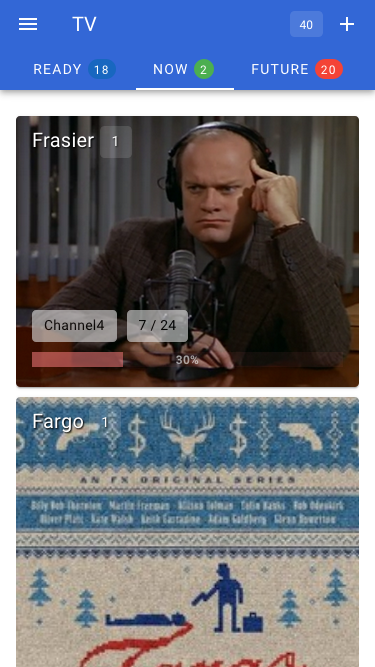
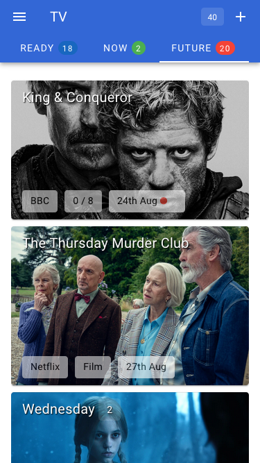
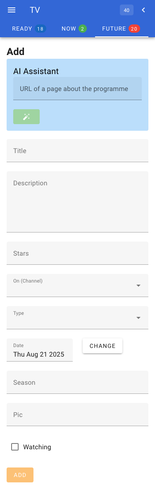

# tv

## Terraform-built infrastructure

This app requires some Cloudflare infrastructure, all of which is created using Terraform:

1. A KV namespace.
2. A Cloudflare Pages project, tied to this repo with a binding to the KV Namespace from (1).
3. A custom domain whose traffic is sent the static website from (2).
4. The static website also contains a number of functions which are served out by Cloudflare Workers on the /api/* route.

This project gets deployed on pushes to the main branch on GitHub. Cloudflare detects the push and runs the `./build.sh` script which creates the front end using Nuxt and the API endpoints using "rollup". The API and static frontend is served out by Cloudflare pages.

The Cloudflare pages config, KV store and DNS records are created using Terraform.

## User interface

The web interface display three "tabs": Available to watch, Watching and Future - three separate views of the list of programmes in the database but split up by attributes and sorted in date order in the front end.

Screenshots of the full height of the three tabs:

| Available to watch | Watching | Future |
| ------------------ | ---------| ------ |
|  |  |  |

Viewing a single programme and editing it:

| Adding a programme | Viewing a programme | Editing it |
| ------------------ | ------------------- | ---------- |
|  |  |  |

## Data model

As we only have simple KeyValue store and the Cloudflare KV.list() operation only returns the keys (not the values), the data model packs some data into the key.

| key           | value |  metadata                                                                        |
|---------------|-------|----------------------------------------------------------------------------------|
| 1681893518478 | null  | {"date":"2025-07-05","on":"Netflix","title":"Death By Lightning","type":"Series","uptoep":"0","uptomax":"6","watching":false}                     |


The keys is a timestamp. This allows us to get time-ordered list of programmes with just the `TVKV.list()` function. The value is left blank because we're able to fit a summary in the `metadata` object which has to be < 1kB, but does come back from the `KV.list` function.

The main `value` is everything we know about the programme:

```js
{
  "id": "1738420123614",
  "doc": {
    "title": "Death By Lightning",
    "description": " a limited drama series that’s based on the epic and stranger-than-fiction true story of James Garfield, reluctant 20th president of the United States, and Charles Guiteau — a man who was not only Garfield’s greatest admirer, but also his assassin.",
    "stars": [
      "Matthew Macfadyen",
      "Tuppence Middleton"
    ],
    "on": "Netflix",
    "date": "2025-07-05",
    "season": "",
    "pic": "https://dnm.nflximg.net/api/v6/2DuQlx0fM4wd1nzqm5BFBi6ILa8/AAAAQeZ8XKJL1nBddDmKYm9abZQ9Jao4DKe_ZKqb-WfqGT_VVYMGtK0IFpa5BatLFoknLeUKN0tDOkhkptcdhFwlFyYxMp8WpvV9Ns-ImZ2P-emHIsWQDq3_uDYTltKqGF2LTdypZVLIChTsUeW1cYPuIgh5.jpg?r=1f1",
    "watching": false,
    "type": "Series",
    "uptoep": "0",
    "uptomax": "6"
  },
  "_ts": "2025-02-01T14:28:43.614Z",
  "_freetext": "",
  "_freetextIndex": [],
  "_index": {
    "watching": "false",
    "on": "Netflix"
  }
}
```

The doc has some extra fields for indexing purposes as it was assumed that the kv store would be queried and have secondary indexes:

```
_ts : "2023-05-01T19:52:24.000Z",
_freetext: [] // list of words to be indexed for freetext search
_freetextIndex: [] // list of stemmed and processed words that are actually indexed
_index: {} // a map of key/value pairs to be indexed for this document
```

but in fact, the front end app just uses the "list" to get all the programme's top-level data and when a user needs to see details of a single program, the whole value is fetched from KV instead.

## Performance

The front end app has been highly optimised for performance:

1. It uses [Vite PWA](https://vite-pwa-org.netlify.app/) to make the web app a Progressive Web App (PWA), meaning that the assets of the application are cached locally making for a faster load time (after the first load). 
2. The programme list is cached in local storage so that the app can load and show it's last state quickly - it then fetches the programme list in the background to pick up any changes.
3. The images are loaded in "eager" mode, meaning they're fetched ahead of time making the UI snappier.
4. The KV store's eventual consistency is hidden by writing edits & deletes to the local copy of the data, as well as to the cloud via API calls.

## API

All methods that change data or pass parameters use the `POST` method and expect an `application/json` content type. All API endpoints require a valid `apikey` header or you will get a 401 response.

The API lives at the same URL as the deployed application, but for local development that is not the case so the API plays nicely with CORS to allow that to happen.

## Add a todo - POST /api/add

Parameters:

- `title` - the title of the todo (required)
- `description` - additional description
- more!!

e.g.

```sh
curl -X POST -H'Content-type:application/json' -H'apikey: abc123' -d'{"title":"Milk","description":"semi-skimmed"}' "https://$URL/api/add" 
{"ok":true,"id":"1681482390981:Milk"}
```

## Get a single todo - POST /api/get

Parameters:

- `id` - the id of the todo (required)

e.g.

```sh
curl -X POST -H'Content-type:application/json' -H'apikey: abc123' -d'{"id":"1695397182714"}' "https://$URL/api/get"
{"ok":true,"doc":{"title":"Wednesday","description":"Goth caper","stars":[],"on":"Netflix","date":"2023-09-22","season":"","pic":"","watching":false,"id":"1695397182714"}}
```

## List multiple todos - POST /api/list

Parameters

- n/a

e.g.

```sh
curl -X POST -H'Content-type:application/json' -H'apikey: abc123' "https://$URL/api/list"
{"ok":true,"list":[{"id":"1695397113199","date":"2023-09-22","title":"Wilderness","watching":false},{"id":"doc:1695397182714","date":"2023-09-22","title":"Wednesday","watching":false},{"id":"1695397233088","date":"2023-09-22","title":"Stranger Things","watching":true}]}
```

## Delete a todo - POST /api/delete

Parameters:

- `id` - the id of the todo to delete (required)

```sh
curl -X POST -H'Content-type:application/json' -H'apikey: abc123' -d'{"id":"1681482390981"}' "https://$URL/api/delete"
{"ok":true}
```

## Query - POST /api/query

Parameters:

- `key` - the name of the key to query on (required)
- `value` - the value needed (required)

```sh
curl -X POST -H'Content-type:application/json' -H'apikey: abc123' -d'{"key":"on","value":"Netflix"}' "https://$URL/api/query"
{"ok":true,"list":[{"id":"1695397182714","date":"2023-09-22","title":"Wednesday","watching":false},{"id":":1695397233088","date":"2023-09-22","title":"Stranger Things","watching":true}]}
```

## Build

The Cloudflare Worker platform will only accept a single JavaScript file per worker. When you have multiple workers, there is a tendency for them to share data: constants, library functions etc. It is anathema to developers to repeat code across files so what is the solution?

 - write code in the normal way, with centralised "lib" files containing code or data that is shared.
 - use `import` statements in each worker file to import data from the files
 - use the [rollup](https://rollupjs.org/) utility to pre-process each worker JS file prior to uploading.

 This produces files in the `/functions/api` folder which are those picked up by Cloudflare and turned into Workers.

 e.g. in `lib/somefile.js`

```js
export const someFunction = () => {
  return true  
}
```

And in your worker JS file:

```js
import { someFunction } from './lib/somefile.js'
someFunction()
```

And roll up with:

```sh
# create a distributable file in the 'dist' folder based on the source file
npx rollup --format=es --file=dist/add.js -- add.js
```

We can also "minify" the rolled up files to make them smaller, but this does change variable names to single-letter names which makes debugging tricky:

```sh
# create a minified distributable file in the 'dist' folder based on the source file
npx rollup -p @rollup/plugin-terser --format=es --file=../functions/api/add.js -- add.js
```

